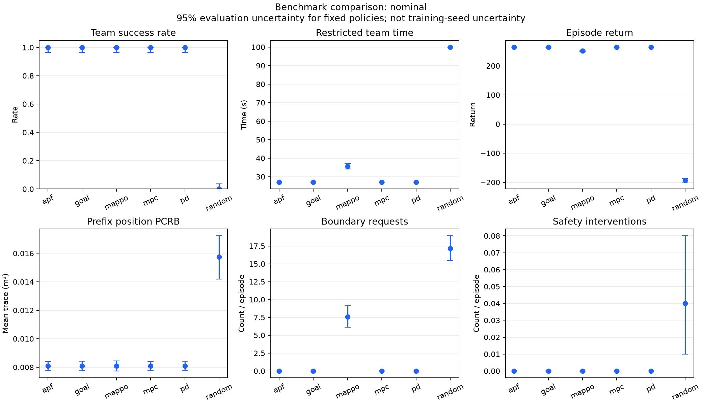
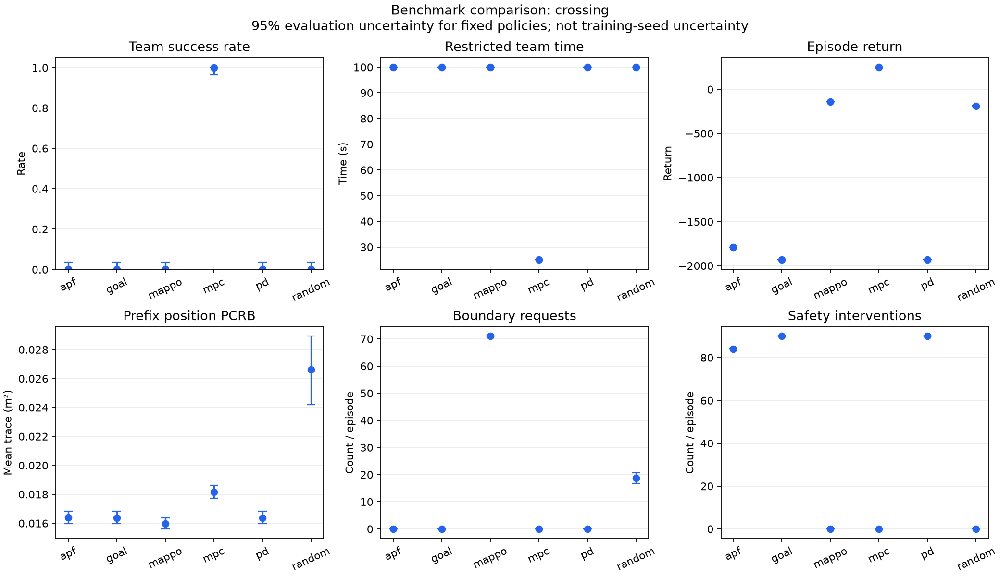

# 规则基线与 MAPPO：实际结果与结论

本轮完成 **6 种方法 × 5 个场景 × 100 个评估种子 = 3000 回合**。主要结论是：**现有 MAPPO checkpoint 在训练场景可以完成任务，但尚未优于简单目标导航；对两个未见几何场景的迁移失败。** 这份结论评价当前模型与本轮配置，不代表 MAPPO 算法的一般能力上限。

## 实验依据

- 模型：`run_seed7_gpu/policy.pt`，训练 seed=7，300 epochs × 2048 = 614400 个联合环境步。没有重新训练或挑选新模型。
- 正式评估：连续种子2001–2100；调试另用1901、1902。控制器参数在正式运行前固定，未根据结果调整。
- 评估：冻结策略、CPU 推理；各方法同场景、奖励、运动约束与安全层。
- 100个评估种子改变随机扰动，不改变同一场景的几何；这不是100个训练种子或100种场景。
- 全部源码和模型的 SHA-256、参数与环境记录在 [manifest.json](../experiments/benchmark_20260927/manifest.json)。运行时有未提交新文件，故同时记录源码哈希；图标题后处理单独留有记录。
- 完整数据：[逐回合 CSV](../experiments/benchmark_20260927/episodes.csv)、[汇总 CSV](../experiments/benchmark_20260927/summary.csv)、[配对差值 CSV](../experiments/benchmark_20260927/paired.csv)、[完整报告](../experiments/benchmark_20260927/REPORT.md)。

## 1. 成功率：不能只看训练场景

下表每个单元格都是成功回合数/100。100/100的95% Wilson区间约为[96.3%,100%]；0/100约为[0%,3.7%]。

| 方法 | 原场景 | CSI噪声增大 | 30秒期限 | 交叉航线 | 改变终点 |
| --- | --- | --- | --- | --- | --- |
| 随机动作 | 0/100 | 0/100 | 0/100 | 0/100 | 0/100 |
| 目标导航 Goal | 100/100 | 100/100 | 100/100 | 0/100 | 100/100 |
| PD | 100/100 | 100/100 | 100/100 | 0/100 | 100/100 |
| 人工势场 APF | 100/100 | 100/100 | 100/100 | 0/100 | 100/100 |
| 有限候选导航 MPC | 100/100 | 100/100 | 100/100 | 100/100 | 100/100 |
| 当前 MAPPO | 100/100 | 100/100 | 100/100 | 0/100 | 0/100 |

原场景较容易，简单的 Goal 已能完成任务。因此，MAPPO 的100%成功率只能证明这组评估中的可用性，不能单独证明协同控制算法有优势。

交叉航线中，Goal、PD和当前APF都超时，每回合平均触发安全干预分别为90、90和84次。MPC平均25秒完成，安全干预和越界请求均为零，说明有限前瞻联合规划在这个交叉场景中有实际价值。MAPPO没有完成任务，平均越界请求71次；它相对Goal回报更高也不能代替任务成功。

改变终点后，四种目标导向规则全部成功，MAPPO全部失败，平均越界请求73次。这支持“该冻结模型未能迁移到此未见目标布局”，不能弱化为少量随机失败；也不能仅凭此推断网络究竟记忆了哪些特征。

## 2. 原场景：效率与能耗仍逊于简单方法

| 方法 | 平均团队完成时间/s | 平均团队回报 | 两机总路程/m | 总能耗代理 | 平均越界请求 |
| --- | --- | --- | --- | --- | --- |
| Goal | 27.00 | 264.27 | 235.00 | 48.00 | 0.00 |
| PD | 27.00 | 263.74 | 235.00 | 69.53 | 0.00 |
| APF | 27.00 | 263.66 | 235.00 | 69.52 | 0.00 |
| MPC | 27.00 | 264.27 | 235.00 | 48.00 | 0.00 |
| MAPPO | 35.59 | 251.47 | 243.37 | 74.57 | 7.59 |

按相同种子计算 MAPPO−Goal 的配对差：

- 回报差 **−12.80**，95%区间 **[−14.72, −11.03]**。
- 完成时间差 **+8.59秒**，95%区间 **[+7.14, +10.12]**。

因此，在本轮固定模型、固定原场景和评估种子下，Goal具有更好的回报和任务效率。MAPPO的额外路程、能耗代理与越界请求也没有显示出可补偿这些代价的明确早期感知收益。

PD/APF虽与Goal走出接近的路径，但仍持续请求较大加速度，速度限幅后加速度项仍进入能耗代理，所以能耗数字可以不同。这里报告的是代码定义的代理量，不能换算为真实电池耗电。



## 3. 感知：不能用不同长度回合的均值证明收益

原场景中，全回合平均位置PCRB为 MAPPO 0.026772 m²、Goal 0.031971 m²，看起来MAPPO更低。但两个回合平均持续35.59秒和27秒，包含的时段和有效源历史不同，不能据此单独归因于感知策略改善。

统一看前10步，MAPPO为 **0.008087 m²**，Goal为 **0.008098 m²**。配对差为 **−0.0000115 m²**，95%区间 **[−0.0000791, +0.0000558]**，跨过零。**本轮原场景没有足够证据支持早期感知优势**，也不构成两者等价性的证明。所有方法/场景的前缀有效样本数均为100，没有使用缺失值补齐。

改变终点时，MAPPO的前缀PCRB更低，却0/100完成任务，进一步说明不能仅按感知代理排序。MPC在交叉场景100/100成功，但通信满足率约56.9%，前缀PCRB也没有全面领先；它是导航对照，尚未解决完整通感约束优化。

目标估计仍来自truth + noise代理，PCRB不是实测跟踪误差，因而本轮不能证明真实黑飞跟踪精度的提升。

## 4. 期限缩短为何反而更快

MAPPO在30秒期限场景中100/100成功，平均27秒到达；原场景平均35.59秒。这里并非把原轨迹在30秒处截断，而是重新执行策略。

[observations.py](../observations.py) 使用 `remaining_time = 1 - step / max_steps`。改变 `max_steps` 会同时改变策略看到的剩余时间信号，因此动作可以不同。本轮结果支持“该模型在指定30步期限输入下完成了任务”，不能外推为任意更短期限都能完成。

## 5. 可以用于报告的结论

> 在当前仿真模型中，冻结MAPPO策略在训练几何场景及指定的噪声、期限变化下均完成100次评估任务，但在原场景的回报、耗时和能耗代理上未优于简单目标导航。其固定前10步位置PCRB相对目标导航的配对差区间包含零，尚无明确早期感知收益证据。对交叉航线与改变终点两类未见几何配置，该策略均未完成任务，说明当前固定场景训练尚不足以支持这些场景迁移。有限候选集中导航MPC在交叉场景表现较好，但通信与感知指标仍存在取舍。因此，现阶段结果应作为实现有效性、方法差异与失效模式的对照证据，而非MAPPO整体优越性或真实跟踪精度改善的证明。

这是单个训练seed/单个checkpoint的条件性结果。下一轮学习算法比较应在相同交互预算下加入独立训练种子和IPPO等学习方法；若改为多场景训练，也需要重新划分训练/评估场景，避免在已看过的压力测试集上调参后继续把它称作未见测试集。当前没有把未执行的实验写成结论。



## 复现与修改

正式评估命令（若原输出目录已存在，请改用新的名字）：

```bat
python -m project.benchmark --checkpoint project/output/run_seed7_gpu/policy.pt --suite project/benchmark_config.json --seed-start 2001 --episodes 100 --device cpu --output project/output/benchmark_reproduce
```

训练权重保留在本地，未提交到Git；公共仓库包含逐回合数据、结果图、参数和模型哈希。没有该checkpoint时，可先跑规则方法，或重新训练并记录新模型的哈希。重训不保证与本次checkpoint逐位一致。

```bat
python -m project.train --config project/example_config.json --epochs 300 --seed 7 --eval-seed 1001 1002 1004 1005 --output project/output/retrain_seed7_300
```

方法定义、参数修改位置和统计说明见 [BASELINES.md](BASELINES.md)。本轮新增代码保持小模块结构；全项目58项测试通过，覆盖MPC运动预测、到达冻结、随机策略复现、统计区间、短轨迹缺失处理和完整产物生成。
