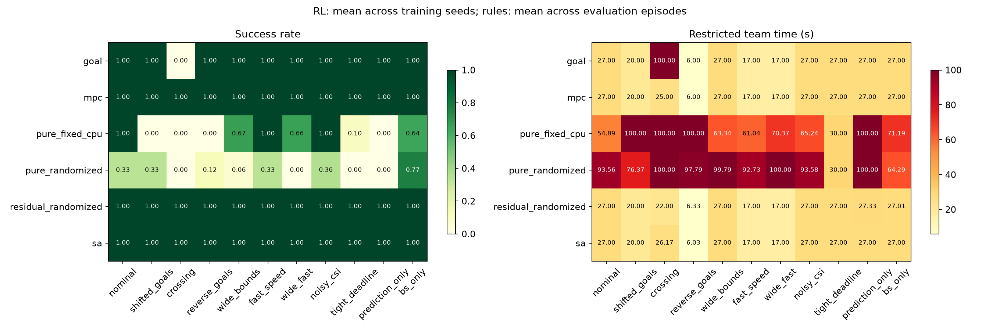
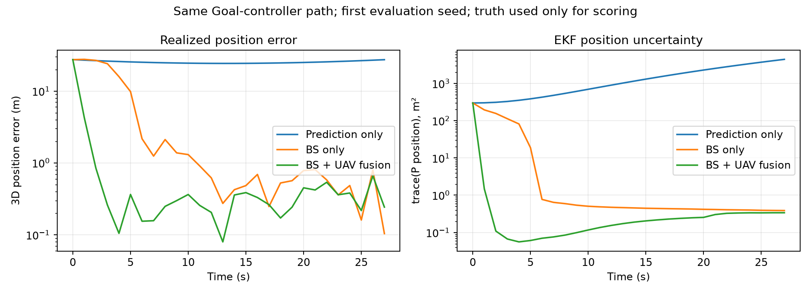

# 闭环感知、泛化与纯／残差 RL：实测结论

[English](CLOSED_LOOP_RESULTS.en.md) · [实现与运行指南](CLOSED_LOOP_STUDY.md) · [完整统计](../experiments/closed_loop_20260927/REPORT.md)

本轮最明确的结果是：**基础目标导航＋学习残差，在当前训练预算下比从零学习完整动作稳定得多；实际仿真量测与 EKF 融合显著降低了目标估计误差。** 残差 RL 在交叉测试中比本次短时域 SA 更快，但普通直达场景的总回报仍略低于 Goal，不能据此宣称全面优于传统方法。

## 实验口径

- 主比较：固定场景纯 RL `pure_fixed_cpu`、随机场景纯 RL `pure_randomized`、随机场景残差 RL `residual_randomized`。
- 每组独立训练种子 7、17、27；每模型 100 epoch × 2048 = 204800 个联合环境步。均为 CPU 采样、CUDA PPO 更新、CPU 确定性评估，使用最后一个 checkpoint。
- 11 个固定测试场景，每模型每场景 30 个评估种子（3001–3030）。主比较 9 个模型共 2970 回合，Goal/MPC/SA 共 990 回合，合计 **3960 回合**。
- 原先已启动的三个 GPU 采样固定场景模型完整训练并保留，另有 990 回合辅助评估，**不并入主比较**。旧 proxy 模型的 900 回合 SA／限制测试单独归档。因此本轮共完成 12 次训练和 5850 个正式评估回合。
- 先平均每个模型的 30 回合，再跨 3 个训练种子统计；完整 CSV 保留均值、样本标准差和范围。3 个训练种子不足以证明稳定收敛或普遍优势；990 个测试回合也不是 990 个独立训练种子。

## 1. 纯 RL 与残差 RL

下表为成功率（%），RL 数值是三个训练种子的平均，规则方法是 30 个评估回合的平均。

| 场景 | 固定纯 RL | 随机场景纯 RL | 随机场景残差 RL | Goal | MPC | SA |
| --- | ---: | ---: | ---: | ---: | ---: | ---: |
| 原始任务 | 100 | 33.3 | 100 | 100 | 100 | 100 |
| 更换终点 | 0 | 33.3 | 100 | 100 | 100 | 100 |
| 交叉路径 | 0 | 0 | 100 | 0 | 100 | 100 |
| 两机同时反向终点 | 0 | 12.2 | 100 | 100 | 100 | 100 |
| 扩大边界 | 66.7 | 5.6 | 100 | 100 | 100 | 100 |
| 提高速度上限 | 100 | 33.3 | 100 | 100 | 100 | 100 |
| 同时扩大边界与提速 | 65.6 | 0 | 100 | 100 | 100 | 100 |
| 较差 CSI | 100 | 35.6 | 100 | 100 | 100 | 100 |
| 30 秒期限 | 10.0 | 0 | 100 | 100 | 100 | 100 |
| 关闭测量更新 | 0 | 0 | 100 | 100 | 100 | 100 |
| 仅 BS 测量 | 64.4 | 76.7 | 100 | 100 | 100 | 100 |

残差三个模型在其全部 990 个评估回合中均成功。原始场景的时间为 27 s；更换终点为 20 s；交叉场景为 22 s。

纯 RL 的跨训练种子波动很大。例如随机场景纯 RL 的原始任务成功率依次为 **0%、0%、100%**，更换终点为 **100%、0%、0%**，两个“33.3%”都不表示每个模型有约三分之一概率成功。固定场景纯 RL 虽在原始任务都能成功，三个模型平均耗时分别为 **63.03、27.00、74.63 s**。只展示一个训练种子会明显误导结论。

左图越接近 1 越好；右图越小越好。右图失败回合按对应期限计时，因此 100 s 常代表失败；30 秒期限场景的失败计 30 s，不能横跨不同期限直接比较这个量。应先看成功率，再看时间。

## 2. 模拟退火究竟比得如何

| 交叉场景 | 成功率 | 平均任务时间（s） | 安全干预／回合 | 平均总回报 | 决策耗时（ms／步） |
| --- | ---: | ---: | ---: | ---: | ---: |
| Goal | 0% | 100（失败记期限） | 90 | -1928.19 | 0.017 |
| MPC | 100% | 25.00 | 0 | 254.05 | 0.362 |
| SA | 100% | 26.17 | 0 | 256.39 | 4.446 |
| 残差 RL | 100% | 22.00 | 0 | 256.49 | 0.293 |

Goal 只指向各自终点，交叉时重复请求危险运动，被环境安全机制拒绝后僵持。MPC 和 SA 使用运动预测协调两机。残差为基础导航增加了提前绕行的能力：相对零残差对应的 Goal，从 0% 提高到 100%，且交叉成功不是靠安全机制反复兜底得到的。这是本轮学习修正有效的直接证据。

相对本次 SA，残差平均时间缩短约 **15.9%**，但回报只高约 0.10，不足以宣称回报有稳定优势；残差种子 27 的交叉回报为 255.96，仍低于 SA 的 256.39。普通场景残差回报为 **264.70**，Goal 为 **266.82**；时间同为 27 s。更换终点也是相同到达时间、Goal 回报略高。

当前 SA 为 horizon=4、16 次 Metropolis 提案，加 5 个参考序列，每步共 21 次模型序列评估。它优化导航距离、控制努力、间距和边界代价，**没有联合优化完整 ISAC 目标，也没有证明求到全局最优**。MPC/SA 为集中规划，两个 RL Actor 执行局部策略，先验和计算量不同。耗时是本机运行记录，未做独占硬件性能基准，应只作为量级参考。

## 3. 扩大边界、提高速度是否有帮助

扩大边界仅改世界上下界，起点、终点和期限不变；提速仅把最大速度从 5 改为 8 m/s，加速度仍为 5 m/s²。模型冻结，没有在新限制下重新训练。

| 控制器／设置 | 原始 | 扩大边界 | 提速 | 两者同时 |
| --- | ---: | ---: | ---: | ---: |
| 固定纯 RL 成功率 | 100% | 66.7% | 100% | 65.6% |
| 固定纯 RL 限制完成时间（s） | 54.89 | 63.34 | 61.04 | 70.37 |
| 残差 RL 成功率 | 100% | 100% | 100% | 100% |
| 残差 RL 完成时间（s） | 27 | 27 | 17 | 17 |
| Goal／SA 完成时间（s） | 27 | 27 | 17 | 17 |

**扩大边界本身没有改善导航；提速是否有用取决于控制器。** 固定纯 RL 的 seed 7 从 63.03 s 变为 92.57 s，seed 17 却从 27 s 变为 18 s，不能只看一个成功模型推断整体收益。提高上限后刹车、转向与饱和行为改变，原策略并不自动适应。

旧 proxy checkpoint 的独立 900 回合测试中，扩大边界让成功率从 100% 降至 40%，扩大并提速降至 0%；首个测试轨迹显示它依赖旧边界裁剪而靠近终点。该证据与本轮种子敏感性一致，但旧模型与新 EKF 模型不能混为一个统计组。详见 [旧模型 SA／限制结果](LIMITS_SA_RESULTS.md)。

残差基础导航显式读取当前速度／加速度上限，纯 Actor 的 31 维输入没有显式包含这些参数，所以此表比较的是整个控制系统对限制的适应性，不能把优势全部归于神经网络泛化。改变速度还会改变进展与能耗奖励的归一化，因此跨速度的回报或能耗代理不能直接说明效率。

## 4. 泛化：多场景训练要配合什么

已实现按回合采样：25% 原始任务、25% 连续交叉任务、50% 连续起终点任务，并随机化期限和 CSI。反向目标也进入训练，但两机同时反向组合留作测试。测试 crossing 几何位于随机训练的交叉分布内，属于新样本测试，不能称作全新的任务类型；固定纯 RL 则没有见过交叉训练。

在相同 204800 步预算下，纯随机场景 RL 的训练成功率尚低：最后 10 个 epoch 三个种子约 **14.1%、9.6%、9.8%**，残差为 **98.7%、99.7%、99.2%**。它首先是训练分布上仍未学好的问题，不能全归因于训练好之后的泛化失败。残差把基本导航写成可靠规则，让 PPO 集中学习小幅修正，减少成功探索的难度；相同步数也因此覆盖了更多完整任务。

建议按以下顺序继续，而不是只加大世界：

1. 保留残差作为工程基线，同时对纯 RL 采用简单任务→交叉→连续目标的课程，或先模仿 Goal/MPC/SA 的可行动作，再用 PPO 微调。
2. 对纯随机场景 RL 增加预先规定的训练预算，沿学习曲线判断训练成功率是否仍上升；用独立验证集选择超参数，正式测试集保持冻结。
3. 随机化速度／加速度时把已知限制加入条件输入；位置特征继续强调目标相对量，避免仅记住特定绝对坐标和边界。
4. 单独扩展目标初始位置、速度、机动、观测噪声、上传丢失与延迟，并留出完整组合测试。当前目标运动固定，本轮没有验证目标运动的分布外泛化。

这些是下一轮建议，本轮没有通过测试成绩反向挑选更有利的训练配置或模型。

## 5. 实际仿真量测 → 融合滤波 → 后续决策

每步先做状态预测，再用先验估计设置波束，生成 BS 单基地和 UAV 双基地带噪量测，依据通信条件上传并做顺序 EKF 更新。下一步 Actor/Critic 使用后验状态与协方差。黑飞真值仅用于仿真传感器、物理传播、离线评分和诊断绘图，不作为 Actor/Critic 状态输入。

在**同一个 Goal 导航路径**上，以相同 30 个评估种子比较前 10 步三维位置 RMSE：

| 估计方式 | RMSE 均值（m） | 中位数（m） |
| --- | ---: | ---: |
| 只有预测，无量测更新 | 19.465 | 20.080 |
| 仅 BS 量测更新 | 4.726 | 1.269 |
| BS＋UAV 多源融合 | **0.706** | **0.331** |

多源相对 BS-only 的配对均值差为 -4.021 m；按评估种子配对 bootstrap 的 95% 百分位区间为 [-6.805, -1.835] m（随机种子 20260927，200000 次重采样），30 个种子均改善。BS-only 存在明显长尾，不能只报均值而不提醒其分布。统计保存在 [tracking_ablation_statistics.json](../experiments/closed_loop_20260927/tracking_ablation_statistics.json)。

上图是预定第一评估种子 3001，初始位置误差约 27.36 m，是一个困难样本，**不是 30 回合平均曲线**。左图是真实实现的误差，右图是 EKF 自报协方差迹；两者不同，单次更新也不保证每一步的实际误差都变小。

目前证明了“测量融合改善估计”，也接通了“估计参与决策”的软件闭环；**尚未证明 RL 学会主动改善感知几何，并因此提升任务表现**。Goal 忽略目标估计仍然成功，残差关闭测量后仍为 100% 到达。固定纯 RL 关闭测量后失败，也可能反映观测分布偏移，不能单独当成主动感知成功的证据。更准确的感知不会自动产生更优策略。

原因在任务与奖励中也能看到：到达每机 +40、全部完成 +80、安全干预每次 -20；感知每步为 `-0.2 * rho / (rho + 1)`，最多扣 0.2。当前设计有意优先到达和安全，普通导航对目标位置依赖较弱。若研究目标是“学习主动感知”，下一轮应在任务可行的前提下引入有意义的感知质量约束／信息增益，并与明确优化相同感知目标的规划方法比较，报告导航—感知的权衡；不应强行让已到达 UAV 留场持续跟踪。

量测仍是仿真模型：原 SINR→CRB 用作未校准方差代理，设置路径长度、角度、距离率噪声下限；上传由既有通信 SINR 门控，未加入独立上行队列／时延模型；广播按可靠零时延处理。`rho_pos` 在新模式中是 EKF 后验位置协方差迹，不能称为真实 PCRB。

## 图表与代码入口

- [学习曲线](../experiments/closed_loop_20260927/learning_curves.png)：线为跨训练种子中位数，阴影为最小—最大；训练分布不同的回报不能单独比较能力。
- [轨迹比较](../experiments/closed_loop_20260927/trajectory_comparison.png)：同一训练／评估首种子；蓝红友机、橙色 BS、黑色目标诊断真值、绿色估计。不是统计平均轨迹。
- 感知模型：`tracking.py`、`physics.py`；残差：`control.py`；训练随机化：`training_scenarios.py`。
- 改权重／预算：`closed_loop_config.json`、`study_config.json`；测试场景：`study_scenarios.json`；SA：`annealing.py`、`planning.py`。
- 原始数据和重绘命令见 [归档说明](../experiments/closed_loop_20260927/README.md)，单行 CMD 训练命令见 [实验指南](CLOSED_LOOP_STUDY.md)。权重保留在本地 `project/output/`，不随 Git 上传。
