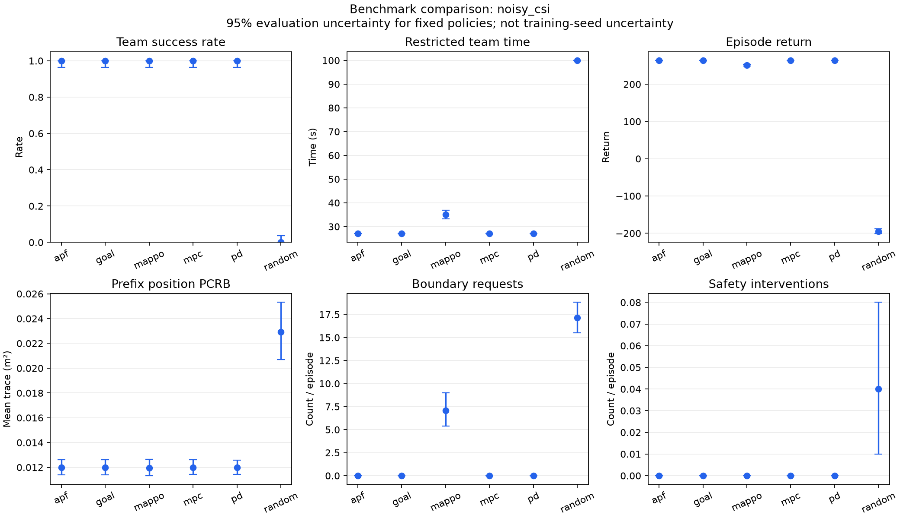
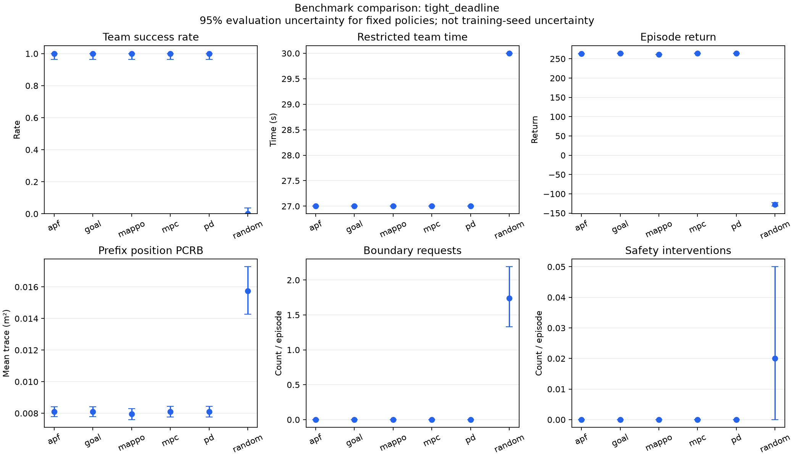
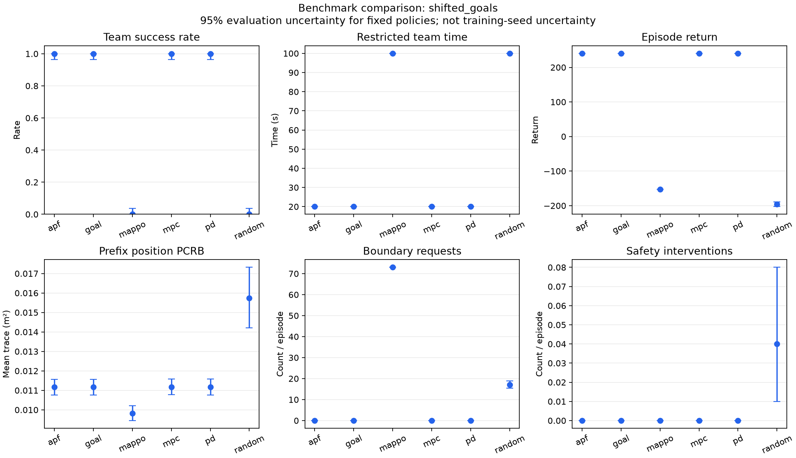

# 规则基线与冻结 MAPPO 对比

共 3000 回合；每个场景、每种方法使用同一组 100 个评估种子。
完整种子、场景、参数、源码哈希与运行环境见 `manifest.json`。

MAPPO 训练种子为 7，训练预算为 614400 个联合环境步。
Checkpoint SHA-256：`ccd57ea2eeb089df4718add2be4e4450adaaab0687e19b91a3623300531dc696`。

## 统计口径

- 成功率区间使用 95% Wilson；连续均值区间使用 2000 次评估回合 bootstrap。
- 区间只反映给定策略下的评估波动；单个训练种子不能证明训练稳定性。
- 同种子用于配对；活动源退出时 RNG 消耗可不同，不是严格共同随机数。
- 限制完成时间：成功用实际时间，失败用该场景期限；越低越好。
- 成功耗时均值只统计成功回合，样本数见 summary.csv，不能单独评价失败多的方法。
- 前缀感知指标为第 1 至 10 步的位置 PCRB 平均值，排除初始先验；不足前缀长度记缺失。
- 全回合 PCRB、能耗和路程随回合长度改变；均为补充指标，不能脱离成功率排序。
- 通信满足率按两机活动步数加权；能耗为无量纲代理，不是焦耳。
- 碰撞数与安全干预数分别记录，零碰撞可能来自环境拒绝危险动作。
- 决策耗时仅计预热后的 policy.act，不含环境物理计算；这是单进程参考计时。
- 规则方法无需训练；MPC 联合使用两机观测规划，属于集中导航参考。
- nominal 是训练配置；其他场景属于指定的分布移位压力测试。

## nominal

Training scenario, unchanged.

| 方法 | 成功/回合 | 成功率 95% CI | 回报均值 [95% CI] | 限制完成时间/s [95% CI] |
| --- | --- | --- | --- | --- |
| apf | 100/100 | 100.0% [96.3%, 100.0%] | 263.66 [263.64, 263.68] | 27.00 [27.00, 27.00] |
| goal | 100/100 | 100.0% [96.3%, 100.0%] | 264.27 [264.25, 264.29] | 27.00 [27.00, 27.00] |
| mappo | 100/100 | 100.0% [96.3%, 100.0%] | 251.47 [249.55, 253.31] | 35.59 [34.09, 37.08] |
| mpc | 100/100 | 100.0% [96.3%, 100.0%] | 264.27 [264.25, 264.30] | 27.00 [27.00, 27.00] |
| pd | 100/100 | 100.0% [96.3%, 100.0%] | 263.74 [263.72, 263.76] | 27.00 [27.00, 27.00] |
| random | 0/100 | 0.0% [0.0%, 3.7%] | -193.20 [-199.81, -186.82] | 100.00 [100.00, 100.00] |

| 方法 | 前缀 PCRB/m² | 前缀样本数 | 路程/m | 能耗代理 | 通信满足率 | 越界请求 | 安全干预 | 碰撞 | 决策/ms |
| --- | --- | --- | --- | --- | --- | --- | --- | --- | --- |
| apf | 0.008098 | 100 | 235.00 | 69.52 | 1.0000 | 0.00 | 0.00 | 0.00 | 0.056 |
| goal | 0.008098 | 100 | 235.00 | 48.00 | 1.0000 | 0.00 | 0.00 | 0.00 | 0.017 |
| mappo | 0.008087 | 100 | 243.37 | 74.57 | 1.0000 | 7.59 | 0.00 | 0.00 | 0.189 |
| mpc | 0.008098 | 100 | 235.00 | 48.00 | 1.0000 | 0.00 | 0.00 | 0.00 | 0.338 |
| pd | 0.008098 | 100 | 235.00 | 69.53 | 1.0000 | 0.00 | 0.00 | 0.00 | 0.028 |
| random | 0.015748 | 100 | 872.87 | 228.52 | 0.9618 | 17.16 | 0.04 | 0.00 | 0.005 |

## noisy_csi

CSI error beta increases from 0.1 to 0.3.

| 方法 | 成功/回合 | 成功率 95% CI | 回报均值 [95% CI] | 限制完成时间/s [95% CI] |
| --- | --- | --- | --- | --- |
| apf | 100/100 | 100.0% [96.3%, 100.0%] | 263.32 [263.30, 263.34] | 27.00 [27.00, 27.00] |
| goal | 100/100 | 100.0% [96.3%, 100.0%] | 263.94 [263.92, 263.96] | 27.00 [27.00, 27.00] |
| mappo | 100/100 | 100.0% [96.3%, 100.0%] | 251.49 [249.06, 253.62] | 35.07 [33.34, 36.93] |
| mpc | 100/100 | 100.0% [96.3%, 100.0%] | 263.94 [263.92, 263.96] | 27.00 [27.00, 27.00] |
| pd | 100/100 | 100.0% [96.3%, 100.0%] | 263.40 [263.38, 263.42] | 27.00 [27.00, 27.00] |
| random | 0/100 | 0.0% [0.0%, 3.7%] | -194.79 [-201.10, -188.13] | 100.00 [100.00, 100.00] |

| 方法 | 前缀 PCRB/m² | 前缀样本数 | 路程/m | 能耗代理 | 通信满足率 | 越界请求 | 安全干预 | 碰撞 | 决策/ms |
| --- | --- | --- | --- | --- | --- | --- | --- | --- | --- |
| apf | 0.011998 | 100 | 235.00 | 69.52 | 1.0000 | 0.00 | 0.00 | 0.00 | 0.056 |
| goal | 0.011998 | 100 | 235.00 | 48.00 | 1.0000 | 0.00 | 0.00 | 0.00 | 0.017 |
| mappo | 0.011967 | 100 | 243.64 | 74.47 | 1.0000 | 7.07 | 0.00 | 0.00 | 0.193 |
| mpc | 0.011998 | 100 | 235.00 | 48.00 | 1.0000 | 0.00 | 0.00 | 0.00 | 0.337 |
| pd | 0.011998 | 100 | 235.00 | 69.53 | 1.0000 | 0.00 | 0.00 | 0.00 | 0.027 |
| random | 0.022916 | 100 | 872.87 | 228.52 | 0.9617 | 17.16 | 0.04 | 0.00 | 0.005 |

## tight_deadline

Same geometry with a 30-second deadline (30 one-second steps).

| 方法 | 成功/回合 | 成功率 95% CI | 回报均值 [95% CI] | 限制完成时间/s [95% CI] |
| --- | --- | --- | --- | --- |
| apf | 100/100 | 100.0% [96.3%, 100.0%] | 263.66 [263.64, 263.68] | 27.00 [27.00, 27.00] |
| goal | 100/100 | 100.0% [96.3%, 100.0%] | 264.27 [264.25, 264.29] | 27.00 [27.00, 27.00] |
| mappo | 100/100 | 100.0% [96.3%, 100.0%] | 260.99 [260.95, 261.03] | 27.00 [27.00, 27.00] |
| mpc | 100/100 | 100.0% [96.3%, 100.0%] | 264.27 [264.25, 264.30] | 27.00 [27.00, 27.00] |
| pd | 100/100 | 100.0% [96.3%, 100.0%] | 263.74 [263.72, 263.76] | 27.00 [27.00, 27.00] |
| random | 0/100 | 0.0% [0.0%, 3.7%] | -127.27 [-131.95, -122.52] | 30.00 [30.00, 30.00] |

| 方法 | 前缀 PCRB/m² | 前缀样本数 | 路程/m | 能耗代理 | 通信满足率 | 越界请求 | 安全干预 | 碰撞 | 决策/ms |
| --- | --- | --- | --- | --- | --- | --- | --- | --- | --- |
| apf | 0.008098 | 100 | 235.00 | 69.52 | 1.0000 | 0.00 | 0.00 | 0.00 | 0.056 |
| goal | 0.008098 | 100 | 235.00 | 48.00 | 1.0000 | 0.00 | 0.00 | 0.00 | 0.017 |
| mappo | 0.007954 | 100 | 235.00 | 69.29 | 1.0000 | 0.00 | 0.00 | 0.00 | 0.198 |
| mpc | 0.008098 | 100 | 235.00 | 48.00 | 1.0000 | 0.00 | 0.00 | 0.00 | 0.334 |
| pd | 0.008098 | 100 | 235.00 | 69.53 | 1.0000 | 0.00 | 0.00 | 0.00 | 0.028 |
| random | 0.015748 | 100 | 263.74 | 69.08 | 0.9458 | 1.74 | 0.02 | 0.00 | 0.005 |

## crossing

Equal-altitude intersecting paths; unseen start and goal geometry.

| 方法 | 成功/回合 | 成功率 95% CI | 回报均值 [95% CI] | 限制完成时间/s [95% CI] |
| --- | --- | --- | --- | --- |
| apf | 0/100 | 0.0% [0.0%, 3.7%] | -1788.46 [-1788.49, -1788.42] | 100.00 [100.00, 100.00] |
| goal | 0/100 | 0.0% [0.0%, 3.7%] | -1933.30 [-1933.34, -1933.26] | 100.00 [100.00, 100.00] |
| mappo | 0/100 | 0.0% [0.0%, 3.7%] | -139.47 [-139.62, -139.32] | 100.00 [100.00, 100.00] |
| mpc | 100/100 | 100.0% [96.3%, 100.0%] | 251.76 [251.75, 251.78] | 25.00 [25.00, 25.00] |
| pd | 0/100 | 0.0% [0.0%, 3.7%] | -1933.55 [-1933.58, -1933.51] | 100.00 [100.00, 100.00] |
| random | 0/100 | 0.0% [0.0%, 3.7%] | -187.38 [-193.84, -181.15] | 100.00 [100.00, 100.00] |

| 方法 | 前缀 PCRB/m² | 前缀样本数 | 路程/m | 能耗代理 | 通信满足率 | 越界请求 | 安全干预 | 碰撞 | 决策/ms |
| --- | --- | --- | --- | --- | --- | --- | --- | --- | --- |
| apf | 0.016398 | 100 | 160.00 | 132.00 | 0.0796 | 0.00 | 84.00 | 0.00 | 0.055 |
| goal | 0.016383 | 100 | 100.00 | 110.00 | 0.0796 | 0.00 | 90.00 | 0.00 | 0.016 |
| mappo | 0.015974 | 100 | 669.55 | 202.32 | 0.9600 | 71.00 | 0.00 | 0.00 | 0.225 |
| mpc | 0.018175 | 100 | 229.02 | 52.82 | 0.5687 | 0.00 | 0.00 | 0.00 | 0.340 |
| pd | 0.016383 | 100 | 100.00 | 120.00 | 0.0796 | 0.00 | 90.00 | 0.00 | 0.027 |
| random | 0.026604 | 100 | 871.38 | 228.06 | 0.9746 | 18.77 | 0.04 | 0.00 | 0.005 |

## shifted_goals

Unseen, closer goals within the same flight volume.

| 方法 | 成功/回合 | 成功率 95% CI | 回报均值 [95% CI] | 限制完成时间/s [95% CI] |
| --- | --- | --- | --- | --- |
| apf | 100/100 | 100.0% [96.3%, 100.0%] | 240.01 [240.00, 240.03] | 20.00 [20.00, 20.00] |
| goal | 100/100 | 100.0% [96.3%, 100.0%] | 240.42 [240.40, 240.44] | 20.00 [20.00, 20.00] |
| mappo | 0/100 | 0.0% [0.0%, 3.7%] | -152.51 [-152.72, -152.29] | 100.00 [100.00, 100.00] |
| mpc | 100/100 | 100.0% [96.3%, 100.0%] | 240.42 [240.40, 240.44] | 20.00 [20.00, 20.00] |
| pd | 100/100 | 100.0% [96.3%, 100.0%] | 240.01 [240.00, 240.03] | 20.00 [20.00, 20.00] |
| random | 0/100 | 0.0% [0.0%, 3.7%] | -195.87 [-202.76, -189.05] | 100.00 [100.00, 100.00] |

| 方法 | 前缀 PCRB/m² | 前缀样本数 | 路程/m | 能耗代理 | 通信满足率 | 越界请求 | 安全干预 | 碰撞 | 决策/ms |
| --- | --- | --- | --- | --- | --- | --- | --- | --- | --- |
| apf | 0.011164 | 100 | 180.00 | 53.30 | 1.0000 | 0.00 | 0.00 | 0.00 | 0.056 |
| goal | 0.011164 | 100 | 180.00 | 37.00 | 1.0000 | 0.00 | 0.00 | 0.00 | 0.017 |
| mappo | 0.009828 | 100 | 662.59 | 200.30 | 1.0000 | 73.00 | 0.00 | 0.00 | 0.222 |
| mpc | 0.011164 | 100 | 180.00 | 37.00 | 1.0000 | 0.00 | 0.00 | 0.00 | 0.340 |
| pd | 0.011164 | 100 | 180.00 | 53.30 | 1.0000 | 0.00 | 0.00 | 0.00 | 0.028 |
| random | 0.015748 | 100 | 871.55 | 228.18 | 0.9618 | 17.16 | 0.04 | 0.00 | 0.005 |

## 与 goal 的配对差值

差值方向为 method − goal；回报越大越好，时间与 PCRB 越小越好。
以下区间是探索性比较，没有多重比较校正。

| 场景 | 方法 | 回报差 [95% CI] | 时间差/s [95% CI] | 前缀 PCRB 差/m² [95% CI] |
| --- | --- | --- | --- | --- |
| crossing | apf | 144.84 [144.82, 144.86] | 0.00 [0.00, 0.00] | 0.000015 [0.000014, 0.000016] |
| crossing | mappo | 1793.83 [1793.69, 1793.98] | 0.00 [0.00, 0.00] | -0.000410 [-0.000526, -0.000298] |
| crossing | mpc | 2185.06 [2185.02, 2185.10] | -75.00 [-75.00, -75.00] | 0.001791 [0.001765, 0.001817] |
| crossing | pd | -0.25 [-0.25, -0.25] | 0.00 [0.00, 0.00] | 0.000000 [0.000000, 0.000000] |
| crossing | random | 1745.92 [1739.73, 1752.04] | 0.00 [0.00, 0.00] | 0.010220 [0.007989, 0.012745] |
| noisy_csi | apf | -0.62 [-0.62, -0.62] | 0.00 [0.00, 0.00] | 0.000000 [0.000000, 0.000000] |
| noisy_csi | mappo | -12.46 [-14.75, -10.26] | 8.07 [6.37, 9.97] | -0.000031 [-0.000129, 0.000075] |
| noisy_csi | mpc | 0.00 [0.00, 0.00] | 0.00 [0.00, 0.00] | 0.000000 [0.000000, 0.000000] |
| noisy_csi | pd | -0.54 [-0.54, -0.54] | 0.00 [0.00, 0.00] | 0.000000 [0.000000, 0.000000] |
| noisy_csi | random | -458.73 [-465.25, -452.08] | 73.00 [73.00, 73.00] | 0.010918 [0.008791, 0.013150] |
| nominal | apf | -0.62 [-0.62, -0.62] | 0.00 [0.00, 0.00] | 0.000000 [0.000000, 0.000000] |
| nominal | mappo | -12.80 [-14.72, -11.03] | 8.59 [7.14, 10.12] | -0.000011 [-0.000079, 0.000056] |
| nominal | mpc | 0.00 [0.00, 0.00] | 0.00 [0.00, 0.00] | 0.000000 [0.000000, 0.000000] |
| nominal | pd | -0.54 [-0.54, -0.54] | 0.00 [0.00, 0.00] | 0.000000 [0.000000, 0.000000] |
| nominal | random | -457.47 [-463.90, -451.21] | 73.00 [73.00, 73.00] | 0.007649 [0.006181, 0.009170] |
| shifted_goals | apf | -0.41 [-0.41, -0.41] | 0.00 [0.00, 0.00] | 0.000000 [0.000000, 0.000000] |
| shifted_goals | mappo | -392.93 [-393.14, -392.72] | 80.00 [80.00, 80.00] | -0.001336 [-0.001444, -0.001230] |
| shifted_goals | mpc | 0.00 [0.00, 0.00] | 0.00 [0.00, 0.00] | 0.000000 [0.000000, 0.000000] |
| shifted_goals | pd | -0.41 [-0.41, -0.41] | 0.00 [0.00, 0.00] | 0.000000 [0.000000, 0.000000] |
| shifted_goals | random | -436.29 [-443.38, -429.09] | 80.00 [80.00, 80.00] | 0.004584 [0.003075, 0.006119] |
| tight_deadline | apf | -0.62 [-0.62, -0.62] | 0.00 [0.00, 0.00] | 0.000000 [0.000000, 0.000000] |
| tight_deadline | mappo | -3.28 [-3.32, -3.25] | 0.00 [0.00, 0.00] | -0.000145 [-0.000211, -0.000077] |
| tight_deadline | mpc | 0.00 [0.00, 0.00] | 0.00 [0.00, 0.00] | 0.000000 [0.000000, 0.000000] |
| tight_deadline | pd | -0.54 [-0.54, -0.54] | 0.00 [0.00, 0.00] | 0.000000 [0.000000, 0.000000] |
| tight_deadline | random | -391.55 [-396.09, -386.77] | 3.00 [3.00, 3.00] | 0.007649 [0.006162, 0.009191] |

## 结论边界

目标估计仍采用 truth + noise 代理，没有实际测量与滤波闭环；PCRB 不能作为实测跟踪误差。
本表评价的是给定场景下的任务执行与仿真指标，未比较 IPPO、MADDPG 等重新训练的学习方法，
也未使用多个训练种子；不能据此宣称 MAPPO 的总体最优性或真实系统的感知收益。
