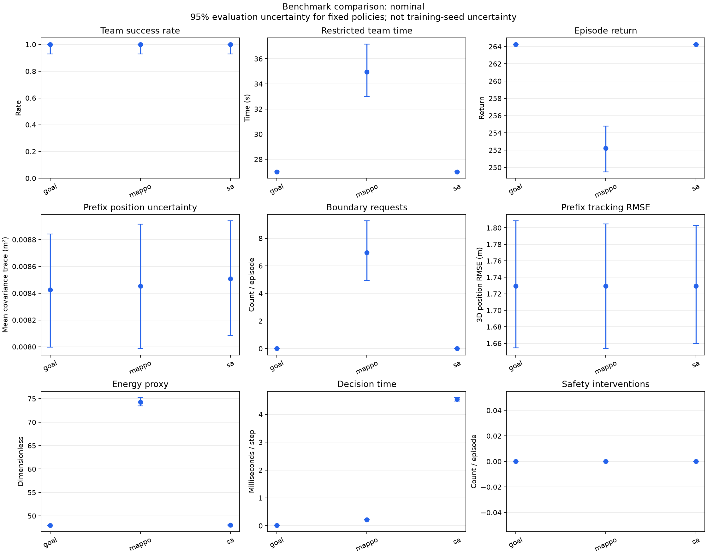
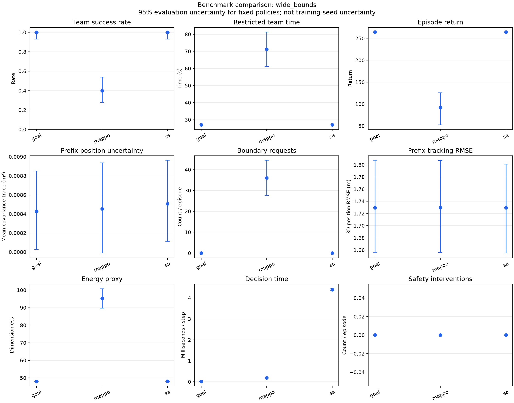
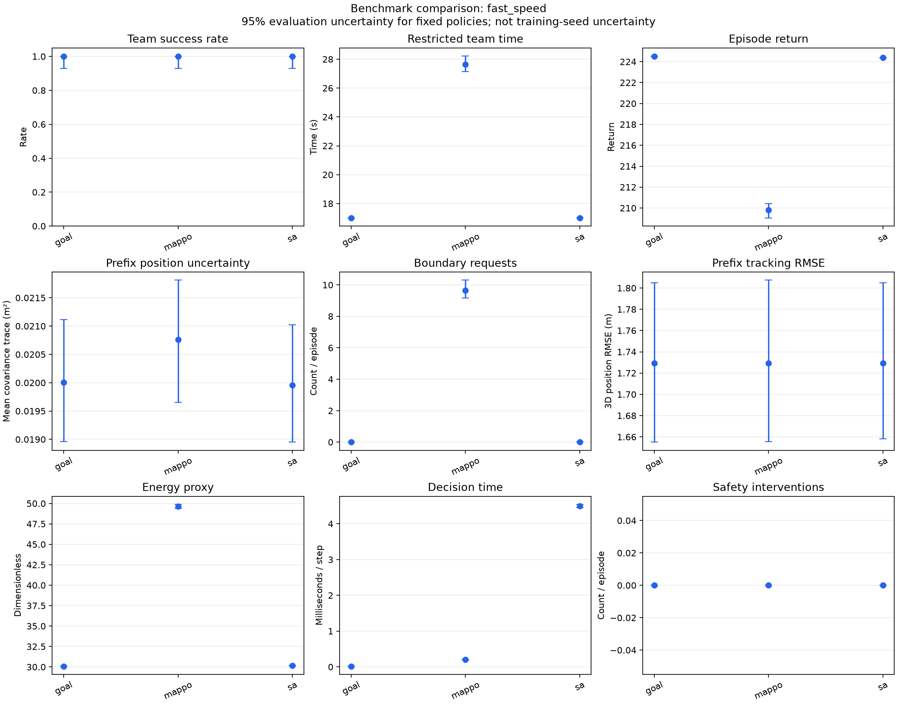
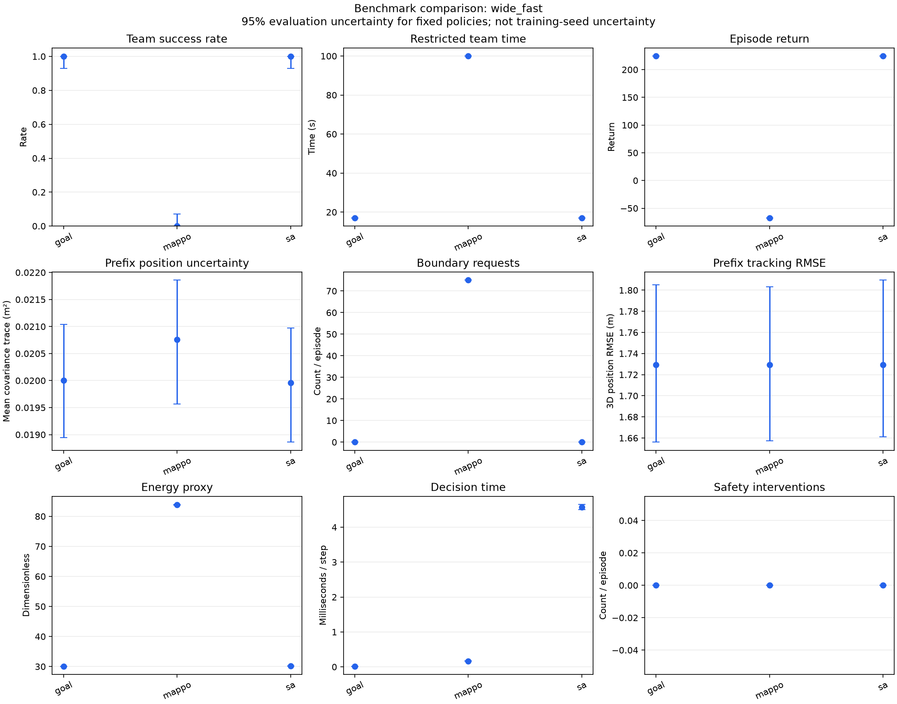
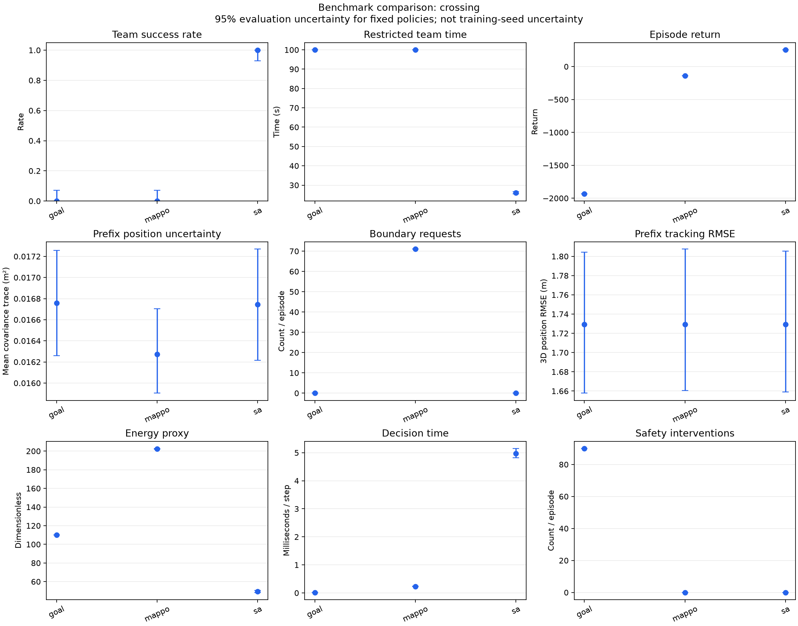
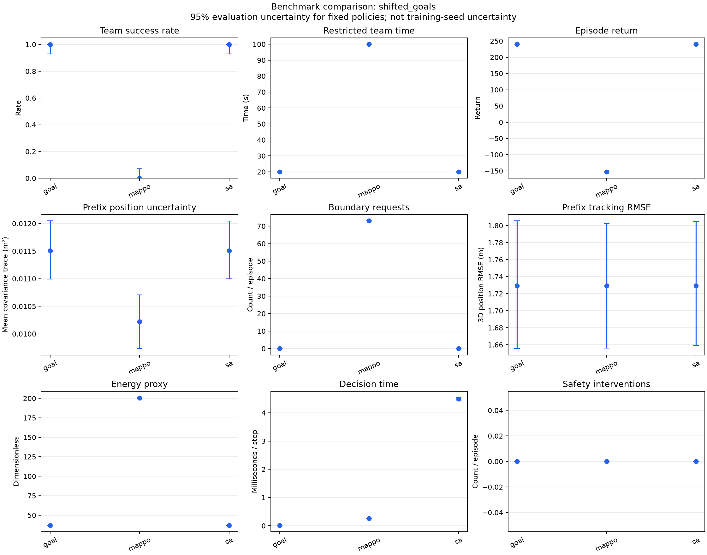

# 规则基线与冻结 MAPPO 对比

共 900 回合；每个场景、每种方法使用同一组 50 个评估种子。
完整种子、场景、参数、源码哈希与运行环境见 `manifest.json`。

MAPPO 训练种子为 7，训练预算为 614400 个联合环境步。
Checkpoint SHA-256：`ccd57ea2eeb089df4718add2be4e4450adaaab0687e19b91a3623300531dc696`。

## 统计口径

- 成功率区间使用 95% Wilson；连续均值区间使用 2000 次评估回合 bootstrap。
- 区间只反映给定策略下的评估波动；单个训练种子不能证明训练稳定性。
- 同种子用于配对；活动源退出时 RNG 消耗可不同，不是严格共同随机数。
- 限制完成时间：成功用实际时间，失败用该场景期限；越低越好。
- 成功耗时均值只统计成功回合，样本数见 summary.csv，不能单独评价失败多的方法。
- 前缀不确定性为第 1 至 10 步的位置 PCRB 代理均值，排除初始先验；不足前缀长度记缺失。
- tracking_prefix_rmse 是同一前缀的三维位置误差 RMSE（m），真值仅用于离线评分。
- 全回合不确定性、跟踪误差、能耗和路程受回合长度影响，优先比较同前缀指标。
- 通信满足率按两机活动步数加权；能耗为无量纲代理，不是焦耳。
- 碰撞数与安全干预数分别记录，零碰撞可能来自环境拒绝危险动作。
- 决策耗时仅计预热后的 policy.act，不含环境物理计算；这是单进程参考计时。
- 规则方法无需训练；MPC/SA 联合使用两机观测规划，属于集中导航参考。
- nominal 是训练配置；其他场景属于指定的分布移位压力测试。

## nominal

Training scenario, unchanged.

| 方法 | 成功/回合 | 成功率 95% CI | 回报均值 [95% CI] | 限制完成时间/s [95% CI] |
| --- | --- | --- | --- | --- |
| goal | 50/50 | 100.0% [92.9%, 100.0%] | 264.25 [264.23, 264.28] | 27.00 [27.00, 27.00] |
| mappo | 50/50 | 100.0% [92.9%, 100.0%] | 252.23 [249.49, 254.77] | 34.96 [33.00, 37.16] |
| sa | 50/50 | 100.0% [92.9%, 100.0%] | 264.24 [264.21, 264.27] | 27.00 [27.00, 27.00] |

| 方法 | 前缀不确定性/m² | 前缀样本数 | 路程/m | 能耗代理 | 通信满足率 | 越界请求 | 安全干预 | 碰撞 | 决策/ms |
| --- | --- | --- | --- | --- | --- | --- | --- | --- | --- |
| goal | 0.008426 | 50 | 235.00 | 48.00 | 1.0000 | 0.00 | 0.00 | 0.00 | 0.018 |
| mappo | 0.008453 | 50 | 243.18 | 74.31 | 1.0000 | 6.96 | 0.00 | 0.00 | 0.219 |
| sa | 0.008507 | 50 | 235.20 | 48.05 | 1.0000 | 0.00 | 0.00 | 0.00 | 4.541 |

## wide_bounds

Only enlarge bounds; keep starts, goals, time, and speed fixed.

| 方法 | 成功/回合 | 成功率 95% CI | 回报均值 [95% CI] | 限制完成时间/s [95% CI] |
| --- | --- | --- | --- | --- |
| goal | 50/50 | 100.0% [92.9%, 100.0%] | 264.25 [264.23, 264.28] | 27.00 [27.00, 27.00] |
| mappo | 20/50 | 40.0% [27.6%, 53.8%] | 91.98 [52.61, 125.78] | 71.20 [61.12, 81.28] |
| sa | 50/50 | 100.0% [92.9%, 100.0%] | 264.24 [264.21, 264.27] | 27.00 [27.00, 27.00] |

| 方法 | 前缀不确定性/m² | 前缀样本数 | 路程/m | 能耗代理 | 通信满足率 | 越界请求 | 安全干预 | 碰撞 | 决策/ms |
| --- | --- | --- | --- | --- | --- | --- | --- | --- | --- |
| goal | 0.008426 | 50 | 235.00 | 48.00 | 1.0000 | 0.00 | 0.00 | 0.00 | 0.017 |
| mappo | 0.008453 | 50 | 292.50 | 95.22 | 1.0000 | 36.00 | 0.00 | 0.00 | 0.184 |
| sa | 0.008507 | 50 | 235.20 | 48.05 | 1.0000 | 0.00 | 0.00 | 0.00 | 4.394 |

## fast_speed

Only increase speed limit from 5 to 8 m/s; acceleration remains 5 m/s².

| 方法 | 成功/回合 | 成功率 95% CI | 回报均值 [95% CI] | 限制完成时间/s [95% CI] |
| --- | --- | --- | --- | --- |
| goal | 50/50 | 100.0% [92.9%, 100.0%] | 224.52 [224.50, 224.54] | 17.00 [17.00, 17.00] |
| mappo | 50/50 | 100.0% [92.9%, 100.0%] | 209.81 [209.05, 210.43] | 27.64 [27.14, 28.22] |
| sa | 50/50 | 100.0% [92.9%, 100.0%] | 224.39 [224.37, 224.41] | 17.00 [17.00, 17.00] |

| 方法 | 前缀不确定性/m² | 前缀样本数 | 路程/m | 能耗代理 | 通信满足率 | 越界请求 | 安全干预 | 碰撞 | 决策/ms |
| --- | --- | --- | --- | --- | --- | --- | --- | --- | --- |
| goal | 0.020002 | 50 | 233.56 | 30.08 | 1.0000 | 0.00 | 0.00 | 0.00 | 0.016 |
| mappo | 0.020760 | 50 | 250.50 | 49.64 | 1.0000 | 9.66 | 0.00 | 0.00 | 0.207 |
| sa | 0.019955 | 50 | 234.00 | 30.14 | 1.0000 | 0.00 | 0.00 | 0.00 | 4.495 |

## wide_fast

Both bounds and speed changed; all other task parameters fixed.

| 方法 | 成功/回合 | 成功率 95% CI | 回报均值 [95% CI] | 限制完成时间/s [95% CI] |
| --- | --- | --- | --- | --- |
| goal | 50/50 | 100.0% [92.9%, 100.0%] | 224.52 [224.50, 224.54] | 17.00 [17.00, 17.00] |
| mappo | 0/50 | 0.0% [0.0%, 7.1%] | -67.46 [-67.53, -67.38] | 100.00 [100.00, 100.00] |
| sa | 50/50 | 100.0% [92.9%, 100.0%] | 224.39 [224.37, 224.41] | 17.00 [17.00, 17.00] |

| 方法 | 前缀不确定性/m² | 前缀样本数 | 路程/m | 能耗代理 | 通信满足率 | 越界请求 | 安全干预 | 碰撞 | 决策/ms |
| --- | --- | --- | --- | --- | --- | --- | --- | --- | --- |
| goal | 0.020002 | 50 | 233.56 | 30.08 | 1.0000 | 0.00 | 0.00 | 0.00 | 0.017 |
| mappo | 0.020760 | 50 | 337.17 | 83.85 | 1.0000 | 75.00 | 0.00 | 0.00 | 0.165 |
| sa | 0.019955 | 50 | 234.00 | 30.14 | 1.0000 | 0.00 | 0.00 | 0.00 | 4.572 |

## crossing

Equal-altitude intersecting paths; unseen start and goal geometry.

| 方法 | 成功/回合 | 成功率 95% CI | 回报均值 [95% CI] | 限制完成时间/s [95% CI] |
| --- | --- | --- | --- | --- |
| goal | 0/50 | 0.0% [0.0%, 7.1%] | -1933.33 [-1933.39, -1933.27] | 100.00 [100.00, 100.00] |
| mappo | 0/50 | 0.0% [0.0%, 7.1%] | -139.44 [-139.63, -139.26] | 100.00 [100.00, 100.00] |
| sa | 50/50 | 100.0% [92.9%, 100.0%] | 254.15 [253.58, 254.66] | 26.00 [25.52, 26.56] |

| 方法 | 前缀不确定性/m² | 前缀样本数 | 路程/m | 能耗代理 | 通信满足率 | 越界请求 | 安全干预 | 碰撞 | 决策/ms |
| --- | --- | --- | --- | --- | --- | --- | --- | --- | --- |
| goal | 0.016759 | 50 | 100.00 | 110.00 | 0.0799 | 0.00 | 90.00 | 0.00 | 0.017 |
| mappo | 0.016272 | 50 | 669.97 | 202.43 | 0.9600 | 71.00 | 0.00 | 0.00 | 0.233 |
| sa | 0.016743 | 50 | 237.35 | 49.53 | 0.6682 | 0.00 | 0.00 | 0.00 | 4.975 |

## shifted_goals

Unseen, closer goals within the same flight volume.

| 方法 | 成功/回合 | 成功率 95% CI | 回报均值 [95% CI] | 限制完成时间/s [95% CI] |
| --- | --- | --- | --- | --- |
| goal | 50/50 | 100.0% [92.9%, 100.0%] | 240.41 [240.39, 240.43] | 20.00 [20.00, 20.00] |
| mappo | 0/50 | 0.0% [0.0%, 7.1%] | -152.57 [-152.90, -152.25] | 100.00 [100.00, 100.00] |
| sa | 50/50 | 100.0% [92.9%, 100.0%] | 240.41 [240.39, 240.43] | 20.00 [20.00, 20.00] |

| 方法 | 前缀不确定性/m² | 前缀样本数 | 路程/m | 能耗代理 | 通信满足率 | 越界请求 | 安全干预 | 碰撞 | 决策/ms |
| --- | --- | --- | --- | --- | --- | --- | --- | --- | --- |
| goal | 0.011508 | 50 | 180.00 | 37.00 | 1.0000 | 0.00 | 0.00 | 0.00 | 0.016 |
| mappo | 0.010220 | 50 | 664.26 | 200.64 | 1.0000 | 73.00 | 0.00 | 0.00 | 0.260 |
| sa | 0.011508 | 50 | 180.00 | 37.00 | 1.0000 | 0.00 | 0.00 | 0.00 | 4.493 |

## 与 goal 的配对差值

差值方向为 method − goal；回报越大越好，时间与不确定性越小越好。
以下区间是探索性比较，没有多重比较校正。

| 场景 | 方法 | 回报差 [95% CI] | 时间差/s [95% CI] | 前缀不确定性差/m² [95% CI] |
| --- | --- | --- | --- | --- |
| crossing | mappo | 1793.90 [1793.71, 1794.09] | 0.00 [0.00, 0.00] | -0.000487 [-0.000652, -0.000339] |
| crossing | sa | 2187.49 [2186.95, 2187.98] | -74.00 [-74.48, -73.44] | -0.000016 [-0.000258, 0.000243] |
| fast_speed | mappo | -14.71 [-15.48, -14.06] | 10.64 [10.14, 11.26] | 0.000758 [0.000613, 0.000910] |
| fast_speed | sa | -0.13 [-0.13, -0.13] | 0.00 [0.00, 0.00] | -0.000047 [-0.000060, -0.000034] |
| nominal | mappo | -12.02 [-14.67, -9.51] | 7.96 [5.94, 10.10] | 0.000026 [-0.000054, 0.000117] |
| nominal | sa | -0.01 [-0.03, 0.00] | 0.00 [0.00, 0.00] | 0.000081 [0.000000, 0.000242] |
| shifted_goals | mappo | -392.98 [-393.29, -392.67] | 80.00 [80.00, 80.00] | -0.001288 [-0.001428, -0.001144] |
| shifted_goals | sa | 0.00 [0.00, 0.00] | 0.00 [0.00, 0.00] | 0.000000 [0.000000, 0.000000] |
| wide_bounds | mappo | -172.28 [-211.67, -132.85] | 44.20 [34.12, 54.28] | 0.000026 [-0.000057, 0.000111] |
| wide_bounds | sa | -0.01 [-0.03, 0.00] | 0.00 [0.00, 0.00] | 0.000081 [0.000000, 0.000242] |
| wide_fast | mappo | -291.98 [-292.06, -291.90] | 83.00 [83.00, 83.00] | 0.000758 [0.000615, 0.000900] |
| wide_fast | sa | -0.13 [-0.13, -0.13] | 0.00 [0.00, 0.00] | -0.000047 [-0.000061, -0.000033] |

## 结论边界

目标估计仍采用 truth + noise 代理，没有实际测量与滤波闭环；PCRB 不能作为实测跟踪误差。
本表评价的是给定场景下的任务执行与仿真指标，未比较 IPPO、MADDPG 等重新训练的学习方法，
也未使用多个训练种子；不能据此宣称 MAPPO 的总体最优性或真实系统的感知收益。
